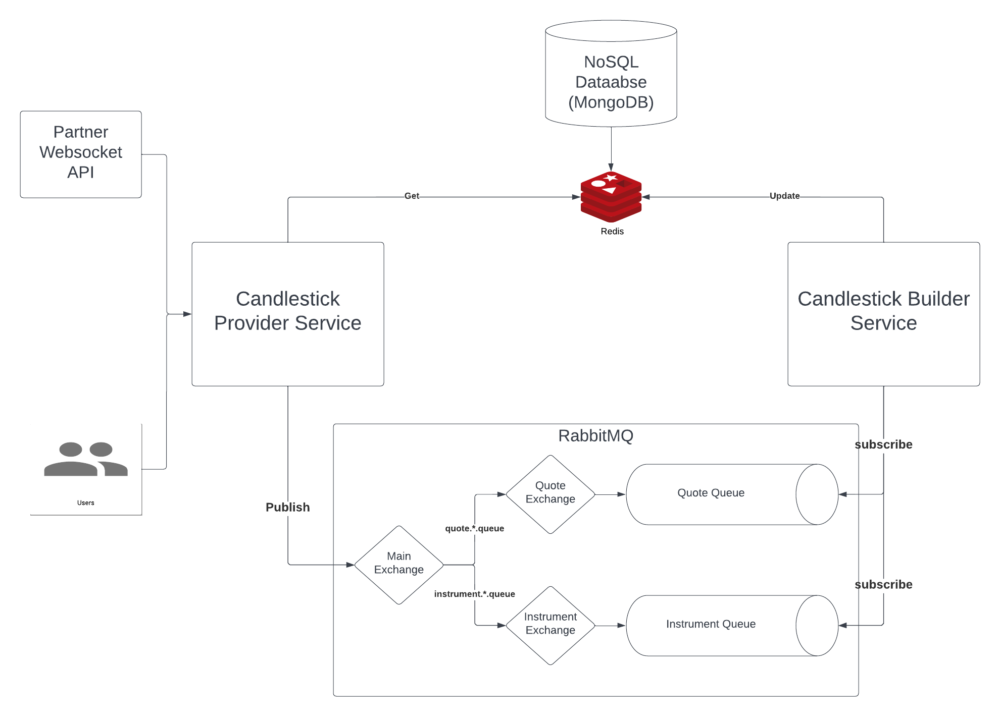

# Candlesticks

### Table of Contents

1. [Overview](#Overview)
   - [Functionalities](#Functionalities)
   - [Scale](#Scale)
   - [Non_Functional_Requirements](#Non_Functional_Requirements)
   - [Architecture](#Architecture)
   - [Algorithm](#Algorithm)
2. [Used_Tech](#Used_Tech)
3. [Requirements](#Requirements)
4. [How_to_run](#How_to_run)
5. [Models](#Models)
6. [Endpoints](#Endpoints)
7. [RabbitMQ](#RabbitMQ)

## Overview

Candlestick API receives live quotes and instrument info from a partner websocket API and creates 1minute candlesticks for which users are able to
view the history of for the last 30 minutes (or the last 30 recent candlesticks). Therefore, by being able to get
all the available (ADDED) instruments, users can decide to fetch the required isin (instrument's id) in order to get the 
list of the last 30 candlesticks. However, there are challenges to designing a system that receives a huge amount of 
quotes from different instruments and has to create candlesticks from the received quotes. Therefore, there are functionalities
required for such a system.

### Functionalities
1) The system opens a websocket to partner API
2) The system receives stream of quotes from the partner API
3) The quotes for a specific instrument in a specific minute should be amassed as a single candlestick
4) The created candlestick should be appended to the list of candlesticks for the instrument
5) Users should be able to get the list of the instruments
6) Users can get an instrument's candlesticks list by the instrument's isin

### Scale
1. Assume there are N instruments
2. Each instrument creates a candlestick for each minute of the day
3. Assume each instrument stays in the catalogue for H hours 
4. Therefore, there would be N * H * 60 (60 min per hour) candlesticks

Example: 

N = 1000, H = 24 => 1440000/day => 525M candlesticks/year

N = 100000, H = 100 => 600000000/day => 219G candlesticks/year

### Non_Functional_Requirements
1) Reliability
   - A system is not really needed to be reliable in terms of being 100 percent accurate about there might be distortion in the data received from 
   the partner API
2) Performance
   - Since the document are mostly fetched and saved and no intricate query is needed, a NoSQL database would be a good choice
   - A system with such throughput needs to process in cache in order to be fast. So Redis is used to increase the performance
   - Data will be fetched from the cache (Redis) and if not available it will be fetched from NoSQL database (MongoDB) and given to 
     the cache and then provided to the user
   - It is integral for the candlestick building to not take place on the same process (or even machine) while the system is receiving
     streams of data. **Therefore two completely independent services have to work with each other through a messaging queue (RabbitMQ)**  
   - Since the trading is normally local, no CDN is needed
3) Maintainable
   - Having two different independent services helps with maintainability
4) Scalability
   - The Scale of the saved data is not considerable and there would be no need for distribution as long as a NoSQL database is used


### Architecture

'

#### Candlestick Provider Service

As it is evident in the picture there are two services working independently with each
other through a messaging queue. The incoming streams of quotes and instruments info come through the websocket to the
**Candlestick Provider Service**, and this service sends the data directly to the messaging queue with a specific route.

1) If the message is an instance of Instrument, the route is `instrument.*` and the message would be sent `instrument_queue`
2) If the message is an instance of Quote, the route is `quote.*` and the message would be sent `quote_queue`

Users can fetch the necessary info they require through this service.


#### Candlestick Builder Service

This service is responsible to creat the candlesticks by listening to the messaging queues and create the associated 
candlesticks from the quotes. It also updates the instrument status (Type) from between ADD and DELETE.


Instruments

1) Listen for instruments coming from the `instrument_queue`
2) Get the Incoming instruments and update the cache and NoSQL database
   
Quotes

1) Listen for quotes coming from the `quote_queue`
2) update candlesticks with algorithm


### Algorithm

This is the algorithm devised in candlestick-builder service when stream of quotes are fetched through the RabbitMQ queue to
process quotes and create/update affiliated candlesticks.

The implementaion can be found at: `candlestick-builder\src\main\java\com\tr\candlestickbuilder\service\message\`


```aidl
Function updateCandlesticks(Q)
   Q= the quote input
   T= timestamp of Q
   P= price of Q
   isin= the isin number in Q 
   Key= the quote timestamp truncated to minute in string
   
   If database has instrument with isin number
   
      I= the instance of the instrument fetched from the database
      M<K, C>= a map where
            K= string representation of timestamp truncated to minute
            C= an instance of a candlestick
      - create a key with quote timestamp truncated to minute (open timestamp of quote)
      
      If key exists in keyset of M<K, C>
        
          If T < open timestamp of C
            - open timestamp of C <- T
            - open price of C <- P
          If T > close timestamp of C
            - close timestamp of C <- T
            - close price of C <- P  
          If P < low price of C
            - low price of C <- P
          If P < high price of C
            - high price of C <- P
            
      else:
      
        - create a new candlestick and put in M<V, C> <- <K, new instance of C updated with Q>
   else
   
    - create a new instrument

```


## Used_Tech


The tech used for this API are:

1) Java 11
2) Spring boot
3) Redis 
4) MongoDB
5) RabbitMQ
6) Hibernate

**Note: While building the app (or Testing), Redis needs sufficient disk space to be mocked** 

## Requirements


1) Java 11
2) Docker (tested on 20.10.13)
3) Maven (tested on 3.6.3)

These requirements should be installed on PATH (environment variables)


## How_to_run

Note: For facilitating manual running, docker-compose containers for the candlestick-provider and candlestick-builder services are not used 

For running the API, the steps below must be followed:

1) To build the jar file for both services (`candlestick-provider` and `candlestick-builder`) run the command bellow on the project's path:

   ```
   Project_Folder_Path> build.sh
   ```
   - Or you can simply run `mvn clean package` in both `candlestick-provider` and `candlestick-builder` folders to create the build in
     target folder. From target folder of both services, you can run `java -jar <the name of the jar file>`

**wait until build is finished**

2) Run `docker.sh` to start the docker-compose.yml services or use `docker-compose up` on the project's path to get the same result.
   ```
   Project_Folder_Path> docker.sh
   ```
   Wait until all dependencies are up and running.
   

**wait until all docker containers are up**


3) After the build is finished, run `run-candlestick-provider.sh` to start the candlestick-provider service
   ```
   Project_Folder_Path> run-candlestick-provider.sh
   ```


4) After the build is finished, run `run-candlestick-builder.sh` to start the candlestick-builder service
   ```
   Project_Folder_Path> run-candlestick-builder.sh
   ```

Now you're ready to start...


## Models


**Candlestick**

|          Name | Json Ignore |  Type   | Description                                                                                                                                                           |
| -------------:|:--------:|:-------:| --------------------------------------------------------------------------------------------------------------------------------------------------------------------- |
|     `isin` | true | string  | instrument isin. |
|     `openTimestamp` | false | Instant  | the timestamp of the first quote within the minute |
|     `currentTimestamp` | true | Instant  | the current received quote timestamp |
|     `openPrice` | false | double  | the time stamp of the price of the first quote within the minute |
|     `highPrice` | false | double  | the highest price of the instrument's quotes within the minute they were sent |
|     `lowPrice` | false | double  | the lowest price of the instrument's quotes within the minute they were sent |
|     `closingPrice` | false | double  | the price of the last quote within the minute |
|     `closeTimestamp` | false | Instant  | the timestamp of the next minute's first quote |


**Instrument**

|          Name | Json Ignore |  Type   | Description                                                                                                                                                           |
| -------------:|:--------:|:-------:| --------------------------------------------------------------------------------------------------------------------------------------------------------------------- |
|     `isin` | false | string  | instrument isin. |
|     `description` | false | string  | the timestamp of the first quote within the minute |
|     `type` | false | Type  | status of the instrument <br><br> can be ADD or DELETE indicating whether the instrument is added to the catalogue or deleted and not shown to users |
|     `candlesticks` | true | List<Candlestick>  | List of all candlesticks |

## Endpoints


Users can access candlestick-provider through the endpoints below:

### Candlestick-provider url:    
`http://localhost:9000`

To test the endpoints, you have two options


#### Option 1: Use Swagger

You can have a UI for api checking by entering the address below in your browser:

`http://localhost:9000/api/swagger-ui.html`


#### Option 2: Use Curl, Postman, or any API testing software

---
### GET
`get 30 candlesticks by isin` [http://localhost:9000/candlesticks?isin={isin}](#get-candlesticks) <br/>
`get all candlesticks by isin` [http://localhost:9000/candlesticks/get-all?isin={isin}](#get-candlesticksget-all) <br/>
`get an instrument by isin` [http://localhost:9000/instruments/{isin}](#get-instrumentsisin) <br/>
`get all instruments` [http://localhost:9000/instruments/get-all](#get-instrumentsget-all) <br/>
`get all added instruments` [http://localhost:9000/instruments/get-all-added](#get-instrumentsget-all-added) <br/>

---
### GET /candlesticks
Gets a list of size at most 30 containing maximum 30 most recent candles sticks of an instrument with isin number provided as the parameter

**Parameters**

|          Name | Required |  Type   | Description                                                                                                                                                           |
| -------------:|:--------:|:-------:| --------------------------------------------------------------------------------------------------------------------------------------------------------------------- |
|     `isin` | required | string  | the available (ADDED) instrument isin. |

**Response**

List< Candlestick >

```

// If instrument isin does not exist with message "Instrument with id:{isin} does not exist!"
{
    "timestamp": "2022-04-26T23:13:44.289+00:00",
    "status": 404,
    "error": "Not Found",
    "message": "Instrument with id:{isin} does not exist!",
    "path": "/candlesticks"
}

// No value present
[]

// a list of 30 or less of the last candlesticks
[
    {
        "openTimestamp": "2022-04-26T21:36:00.893051700Z",
        "openPrice": 361.7534,
        "highPrice": 388.7215,
        "lowPrice": 354.2511,
        "closingPrice": 388.7215,
        "closeTimestamp": "2022-04-26T21:37:03.522518300Z"
    },
    {
        "openTimestamp": "2022-04-26T21:35:04.917360200Z",
        "openPrice": 333.2877,
        "highPrice": 361.2557,
        "lowPrice": 333.2877,
        "closingPrice": 361.2557,
        "closeTimestamp": "2022-04-26T21:36:00.893051700Z"
    },
    {
        "openTimestamp": "2022-04-26T21:34:03.145736800Z",
        "openPrice": 328.8082,
        "highPrice": 338.2922,
        "lowPrice": 323.3014,
        "closingPrice": 330.79,
        "closeTimestamp": "2022-04-26T21:35:04.917360200Z"
    },
...    
]
```
---
### GET /candlesticks/get-all
Gets a list of all of the instrument's (with isin) candlesticks 

**Parameters**

|          Name | Required |  Type   | Description                                                                                                                                                           |
| -------------:|:--------:|:-------:| --------------------------------------------------------------------------------------------------------------------------------------------------------------------- |
|     `isin` | required | string  | the available (ADDED) instrument isin. |

**Response**

List< Candlestick >

```

// If instrument isin does not exist with message "Instrument with id:{isin} does not exist!"
{
    "timestamp": "2022-04-26T23:13:44.289+00:00",
    "status": 404,
    "error": "Not Found",
    "message": "Instrument with id:{isin} does not exist!",
    "path": "/candlesticks"
}

// No value present
[]

// a list of 30 or less of the last candlesticks
[
    {
        "openTimestamp": "2022-04-26T21:36:00.893051700Z",
        "openPrice": 361.7534,
        "highPrice": 388.7215,
        "lowPrice": 354.2511,
        "closingPrice": 388.7215,
        "closeTimestamp": "2022-04-26T21:37:03.522518300Z"
    },
    {
        "openTimestamp": "2022-04-26T21:35:04.917360200Z",
        "openPrice": 333.2877,
        "highPrice": 361.2557,
        "lowPrice": 333.2877,
        "closingPrice": 361.2557,
        "closeTimestamp": "2022-04-26T21:36:00.893051700Z"
    },
    {
        "openTimestamp": "2022-04-26T21:34:03.145736800Z",
        "openPrice": 328.8082,
        "highPrice": 338.2922,
        "lowPrice": 323.3014,
        "closingPrice": 330.79,
        "closeTimestamp": "2022-04-26T21:35:04.917360200Z"
    },
...    
]
```
---
### GET /instruments/{isin}
Gets an instrument by isin

**Parameters**
None

**Response**

Instrument

```

// The returned instrument
{
   "isin": "LJY205120718",
   "description": "ancillae turpis semper sed",
   "type": "ADD"
}

 
// If instrument isin does not exist with message "Instrument with id:{isin} does not exist!"
{
    "timestamp": "2022-04-26T23:13:44.289+00:00",
    "status": 404,
    "error": "Not Found",
    "message": "Instrument with id:{isin} does not exist!",
    "path": "/candlesticks"
}
```

---
### GET /instruments/get-all
Gets all ADDED instruments

**Parameters**
None

**Response**

List< Instrument >

```

// a list of ADDED instruments
[
    {
        "isin": "LJY205120718",
        "description": "ancillae turpis semper sed",
        "type": "ADD"
    },
    {
        "isin": "GN8335463462",
        "description": "imperdiet lectus dui vehicula animal",
        "type": "ADD"
    },
    {
        "isin": "DN7I2P211058",
        "description": "maximus platea tale",
        "type": "DELETE"
    },
    {
        "isin": "MR44L3T03650",
        "description": "veniam platea dicunt discere",
        "type": "DELETE"
    },
    {
        "isin": "OT1364645503",
        "description": "deterruisset purus accommodare commune imperdiet voluptaria",
        "type": "ADD"
    },
    {
        "isin": "RM5375036800",
        "description": "aliquet alia ludus fabulas definiebas gloriatur",
        "type": "DELETE"
    },
    ...
]
```

---
### GET /instruments/get-all-added
Gets all ADDED instruments

**Parameters**
None

**Response**

List< Instrument >

```

// a list of ADDED instruments
[
    {
        "isin": "LJY205120718",
        "description": "ancillae turpis semper sed",
        "type": "ADD"
    },
    {
        "isin": "GN8335463462",
        "description": "imperdiet lectus dui vehicula animal",
        "type": "ADD"
    },
    {
        "isin": "OT1364645503",
        "description": "deterruisset purus accommodare commune imperdiet voluptaria",
        "type": "ADD"
    },
    ...
]
```


## RabbitMQ

you can use the RabbitMQ management system from the url below:

`http://localhost:15672/`

Username: guest
Password: guest


If you need to change the username and password, you can do it by editing the docker-compose.yml file and 
changing the affiliated `application-prod.yml` file in `\candlestick-provider\src\main\resources` and  `\candlestick-builder\src\main\resources`
